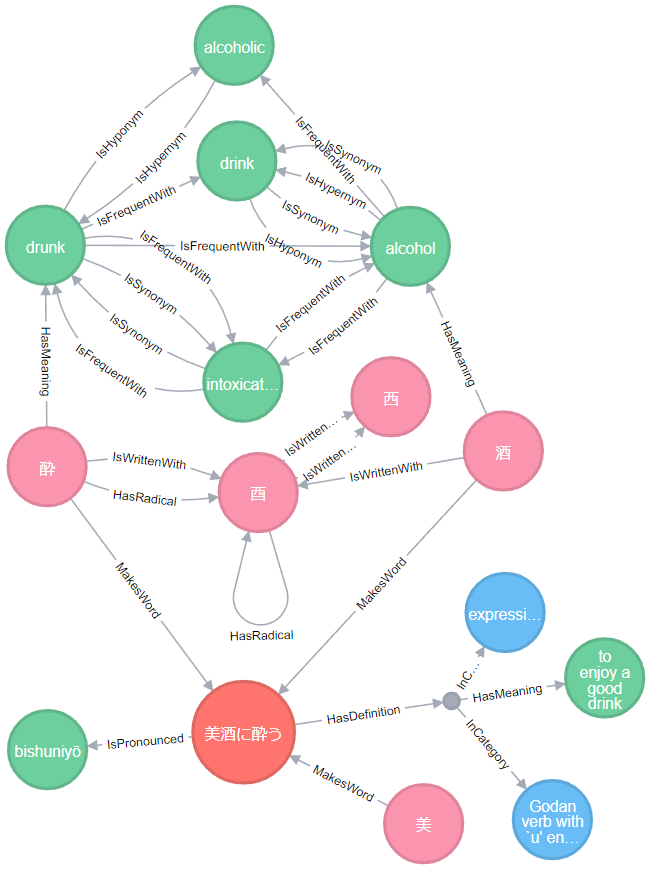
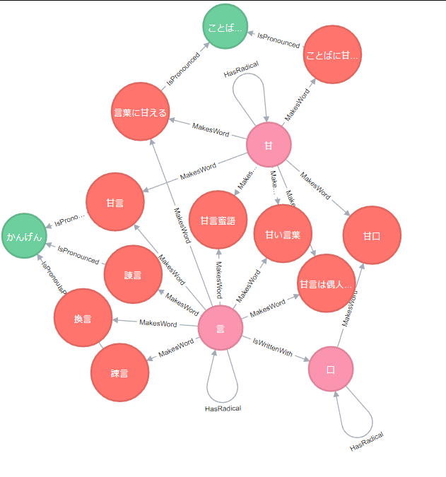

# Kankei

Kankei is a project focused on making Japanese Character Data models from multiple data sources.

For that purpose, a tool was made to help the integration of data.   
it allows to describe datasources and to merge them togheter and then input in multiple model
like json, csv, graph csv etc.

This encourage flexible data model integration
into different kind of databases while keeping
data integrity between them

## Important note 
this project Is not completed and will not be completed in this form even though it offers some flexiblity to import data 
to different format. 

This monolitic architecture makes it really hard to develop it as a single developper. Most of the source code 
of this project shares code with the  [data](kankei-data/data)  source code and so every major 
modification affect in someway a lot of component in the code

Because of that this project will not be continued and probably recreated in a different manner in the future.
Most likely, some parts will be made into smaller tools to eventually remake kankei in the future
  

## Example Result
These examples shows result made from successful conversion and import.

with the various datasources it was possible to merge them and create a Neo4j database
with those data. This images shows the result of a query asking for similar child from two kanji 酔(drunkness) and　酒(alcohol)

this example shows a graph with the kanji data from Monash University,
the kanji vectorial data from KanjiVg and meaning from datamuse combined togheter 




We can notice how easy it is to search word based on their writing





for more examples, please see the [pictures](pictures)

## SETUP 

```bash
pip install -r requirements.txt
```

## Usage

#### Kankei importer
main tool used to import and convert multiple data sources

to get help on how to use it, call on a terminal : 
```bash
python kankei-importer.py -h
```
this tool takes a [configuration file](etc/config.example.yaml)
as an argument. The configuration file describe 
the import actions 

in the configuration file you can reference other python code from:

- [data_aggregators](kankei-data/data_aggregators)
- [data_collectors](kankei-data/data_collectors)
- [data_writers](kankei-data/data_writers)

if you want to add data collections(parsers) and writers, 
please reference to the example code in those folders

#### Kankei Scraper

there is also a kanji-dictionary scrapping tool quickly made to get some data from some website

to get help on how to use it, call on a terminal: 
```bash
python kankei-scraper.py -h
```

## Data sources
Data sources used during this project 

####[JMdict](http://www.edrdg.org/jmdict/edict_doc.html)
created by Jim Breen and now managed by the Electronic Dictionary
Research and Development Group (EDRDG), is a great general dictionary with roughly
170 000 entries and is actively maintained by Jim Breen and a team of volunteers.
This dictionary file is the source word in Kankei.

####[KANJIDIC2](http://nihongo.monash.edu/kanjidic2/index.html)
also from Jim Breen/EDRDG,
is a database of kanji that includes readings, meanings and a lot of metadata around kanji like lookup numbers
for kanji dictionary books, stroke count and information about variant forms.

####[RADKFILE](http://nihongo.monash.edu//kradinf.html)

also from Jim Breen/EDRDG, is a database of the radicals that make up kanji.
This was used to get a data lookup of the japanese radicals.

####[KanjiVG](http://kanjivg.tagaini.net/)

Stroke order data for kanji come from the excellent KanjiVG project, by Ulrich Apel and several contributors.
This was used to map the sub component of kanji in the Kankei Graph.

####[Datamuse](https://www.datamuse.com/api/)

Based on OneLook english word search engine. Datamuse allow to explore words based on their semantics
and how they are indexed in english dictionary.
This was used to connect the semantics of japanese words and kanji together.

#### Kanji Dictionary websites
website used to get extra data about kanji.
these data was not imported into kankei, but it was extracted  

these data was scraped and stored in csv files in [etc](etc).

#####[Kanjipedia](http://www.kanjipedia.jp/)
website containing a some kanji with interesting information about antonym and synonym and 
japanese definition.

#####[Kanjijiten-on](https://kanji.jitenon.jp/)
similar to Kanjipedia contains data related about meaning. however this website contains more kanji.